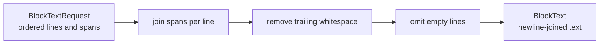

# `pdf.extraction.text` schematic

```mermaid
flowchart LR
    Request["BlockTextRequest<br/>ordered lines and spans"]
    Join["join spans per line"]
    Trim["remove trailing whitespace"]
    Filter["omit empty lines"]
    Result["BlockText<br/>newline-joined text"]

    Request --> Join --> Trim --> Filter --> Result
```
