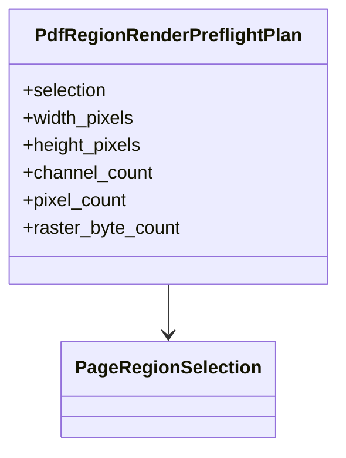

# `PdfRegionRenderPreflightPlan` schematic

```mermaid
classDiagram
    class PageRegionSelection
    class PdfRegionRenderPreflightPlan {
        +selection
        +width_pixels
        +height_pixels
        +channel_count
        +pixel_count
        +raster_byte_count
    }

    PdfRegionRenderPreflightPlan --> PageRegionSelection
```

The plan records allocation facts only and has no reference to concrete page or
raster objects.
