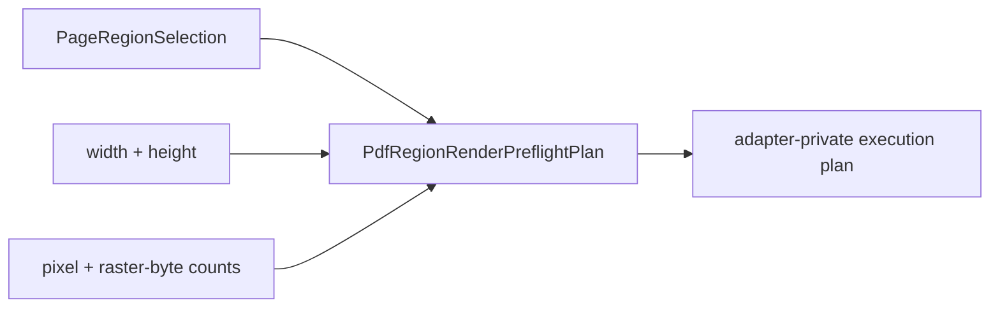

# `pdf.preflight.plan` schematic

```mermaid
flowchart LR
    Selection["PageRegionSelection"]
    Dimensions["width + height"]
    Counts["pixel + raster-byte counts"]
    Plan["PdfRegionRenderPreflightPlan"]
    Execution["adapter-private execution plan"]

    Selection --> Plan
    Dimensions --> Plan
    Counts --> Plan
    Plan --> Execution
```

The concrete adapter augments this neutral allocation record with its own
private coordinate and device geometry; those facts do not enter this module.
