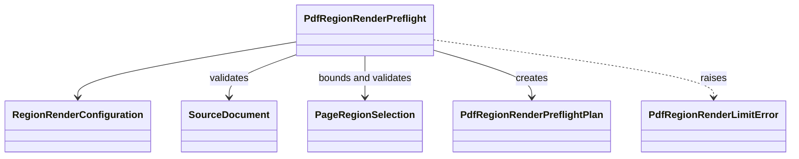

# `PdfRegionRenderPreflight` schematic

```mermaid
classDiagram
    class SourceDocument
    class RegionRenderConfiguration
    class PageRegionSelection
    class PdfRegionRenderPreflightPlan
    class PdfRegionRenderPreflight
    class PdfRegionRenderLimitError

    PdfRegionRenderPreflight --> RegionRenderConfiguration
    PdfRegionRenderPreflight --> SourceDocument : validates
    PdfRegionRenderPreflight --> PageRegionSelection : bounds and validates
    PdfRegionRenderPreflight --> PdfRegionRenderPreflightPlan : creates
    PdfRegionRenderPreflight ..> PdfRegionRenderLimitError : raises
```

The object consumes only domain values, exact source bytes, and primitive
measurements supplied by its caller.
