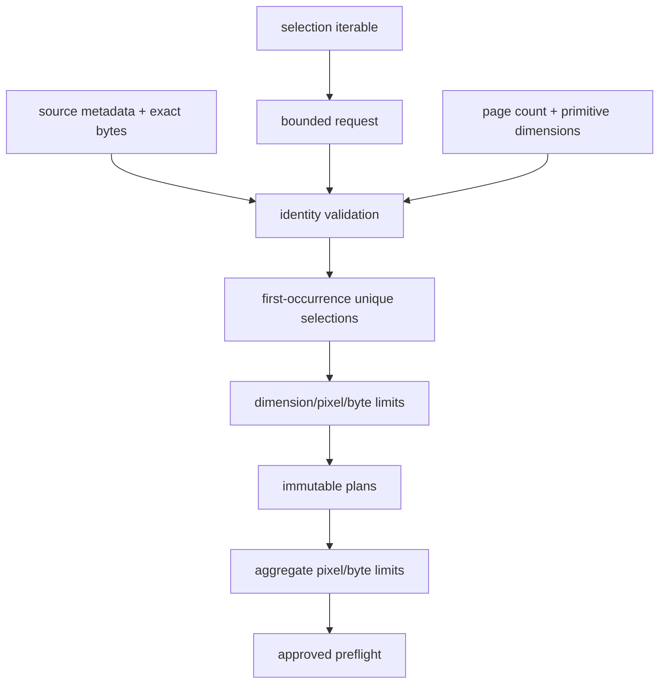

# `pdf.preflight.policy` schematic

```mermaid
flowchart TD
    Iterable["selection iterable"] --> Bound["bounded request"]
    Source["source metadata + exact bytes"] --> Validate["identity validation"]
    Bound --> Validate
    Page["page count + primitive dimensions"] --> Validate
    Validate --> Unique["first-occurrence unique selections"]
    Unique --> PerSelection["dimension/pixel/byte limits"]
    PerSelection --> Plans["immutable plans"]
    Plans --> Aggregate["aggregate pixel/byte limits"]
    Aggregate --> Approved["approved preflight"]
```

All rejection paths occur before raster allocation. The adapter supplies
measurements but cannot bypass or duplicate these checks.
