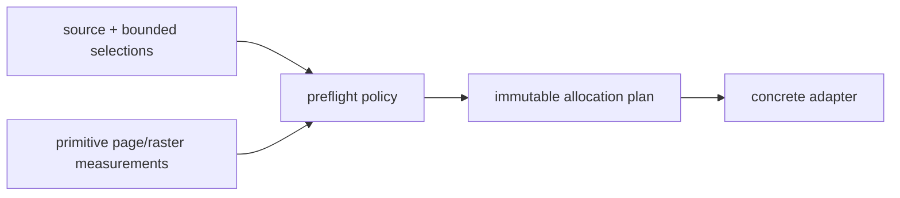

# `projectkoios.ingestion.pdf.preflight` schematic

Only validated primitive facts cross from a concrete adapter into preflight;
backend document, page, rectangle, matrix, pixmap, and colorspace objects do
not.
