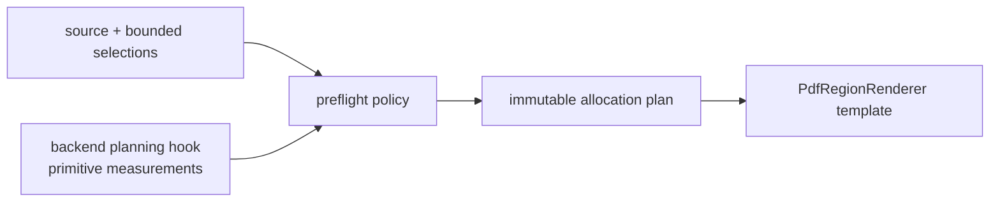

# `projectkoios.ingestion.pdf.preflight` schematic

Only primitive facts from backend planning hooks enter preflight; backend
document, page, rectangle, matrix, pixmap, and colorspace objects do not.
