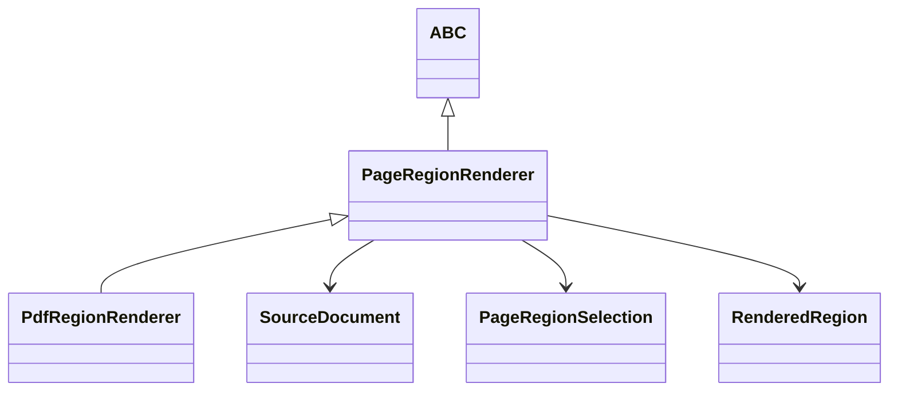

# `PageRegionRenderer` schematic

```mermaid
classDiagram
    class ABC
    class SourceDocument
    class PageRegionSelection
    class RenderedRegion
    class PageRegionRenderer
    class PdfRegionRenderer

    ABC <|-- PageRegionRenderer
    PageRegionRenderer <|-- PdfRegionRenderer
    PageRegionRenderer --> SourceDocument
    PageRegionRenderer --> PageRegionSelection
    PageRegionRenderer --> RenderedRegion
```

The base exposes only renderer identity and domain input/output shape. It has no
configuration, preflight, or backend intermediate objects.
