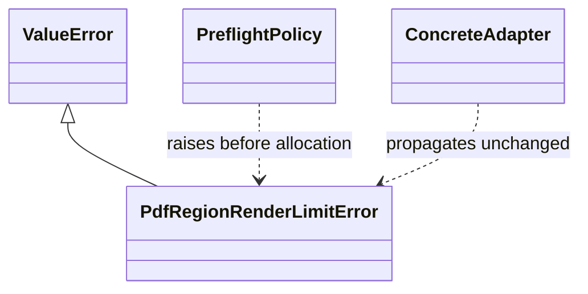

# `PdfRegionRenderLimitError` schematic

```mermaid
classDiagram
    class ValueError
    class PdfRegionRenderLimitError
    class PreflightPolicy
    class ConcreteAdapter

    ValueError <|-- PdfRegionRenderLimitError
    PreflightPolicy ..> PdfRegionRenderLimitError : raises before allocation
    ConcreteAdapter ..> PdfRegionRenderLimitError : propagates unchanged
```

The same class object crosses policy, adapter, and stable package exports.
