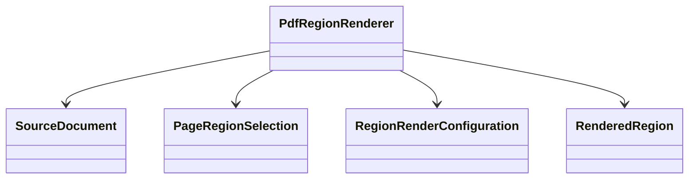

# `PdfRegionRenderer` schematic

```mermaid
classDiagram
    class SourceDocument
    class PageRegionSelection
    class RegionRenderConfiguration
    class RenderedRegion
    class PdfRegionRenderer

    PdfRegionRenderer --> SourceDocument
    PdfRegionRenderer --> PageRegionSelection
    PdfRegionRenderer --> RegionRenderConfiguration
    PdfRegionRenderer --> RenderedRegion
```

The contract exposes domain inputs, configuration identity, and domain outputs
without exposing a backend or its intermediate objects.
