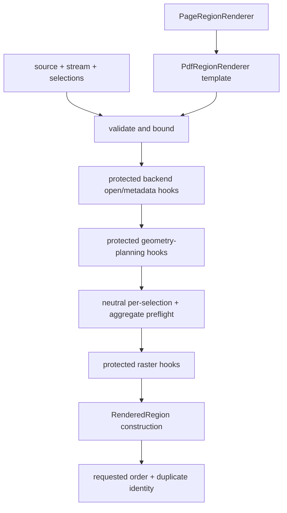

# `PdfRegionRenderer` schematic

```mermaid
flowchart TD
    PageBase["PageRegionRenderer"] --> PdfBase["PdfRegionRenderer template"]
    Request["source + stream + selections"] --> Validate["validate and bound"]
    PdfBase --> Validate
    Validate --> Open["protected backend open/metadata hooks"]
    Open --> Plan["protected geometry-planning hooks"]
    Plan --> Limits["neutral per-selection + aggregate preflight"]
    Limits --> Raster["protected raster hooks"]
    Raster --> Result["RenderedRegion construction"]
    Result --> Order["requested order + duplicate identity"]
```

The template owns control flow and domain results. Protected hooks expose only
the backend mechanics required at each step.
