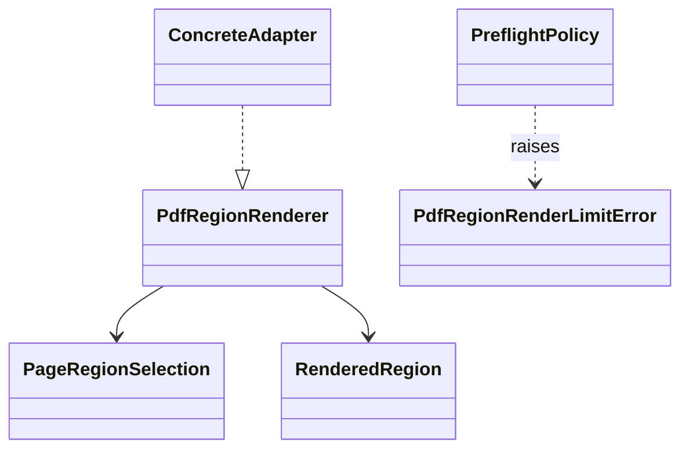

# `pdf.renderer` schematic

```mermaid
classDiagram
    class PdfRegionRenderer
    class PdfRegionRenderLimitError
    class PageRegionSelection
    class RenderedRegion
    class ConcreteAdapter
    class PreflightPolicy

    PdfRegionRenderer --> PageRegionSelection
    PdfRegionRenderer --> RenderedRegion
    ConcreteAdapter ..|> PdfRegionRenderer
    PreflightPolicy ..> PdfRegionRenderLimitError : raises
```

The contract is shared directly by consumers and concrete adapters. It is not a
runtime forwarding or orchestration layer.
