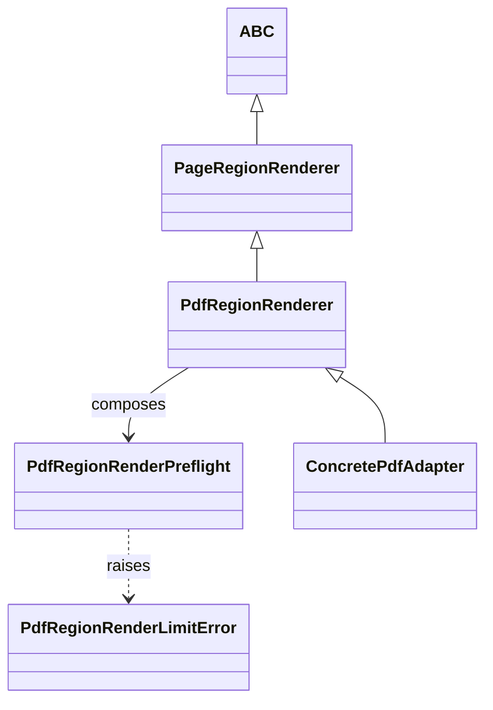

# `pdf.renderer` schematic

```mermaid
classDiagram
    class ABC
    class PageRegionRenderer
    class PdfRegionRenderer
    class PdfRegionRenderLimitError
    class PdfRegionRenderPreflight
    class ConcretePdfAdapter

    ABC <|-- PageRegionRenderer
    PageRegionRenderer <|-- PdfRegionRenderer
    PdfRegionRenderer <|-- ConcretePdfAdapter
    PdfRegionRenderer --> PdfRegionRenderPreflight : composes
    PdfRegionRenderPreflight ..> PdfRegionRenderLimitError : raises
```

Broad consumers depend on `PageRegionRenderer`; PDF-aware consumers may depend
on `PdfRegionRenderer`. Only composition roots select a concrete adapter.
