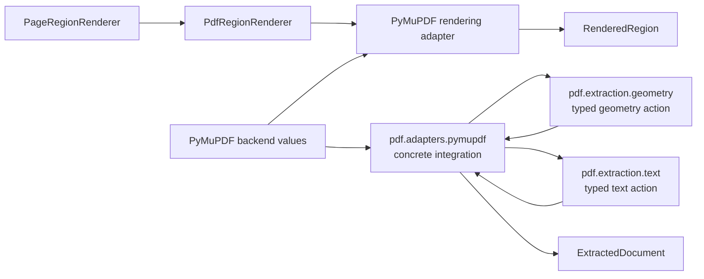

# `projectkoios.ingestion.pdf` schematic

```mermaid
flowchart LR
    Backend["PyMuPDF backend values"]
    Adapter["pdf.adapters.pymupdf<br/>concrete integration"]
    Geometry["pdf.extraction.geometry<br/>typed geometry action"]
    Text["pdf.extraction.text<br/>typed text action"]
    Document["ExtractedDocument"]
    PageBase["PageRegionRenderer"]
    PdfBase["PdfRegionRenderer"]
    Render["PyMuPDF rendering adapter"]
    Region["RenderedRegion"]

    Backend --> Adapter
    Adapter --> Geometry
    Adapter --> Text
    Geometry --> Adapter
    Text --> Adapter
    Adapter --> Document
    PageBase --> PdfBase
    PdfBase --> Render
    Backend --> Render
    Render --> Region
```

Neutral extraction actions classify typed bounded evidence. Concrete adapters
alone translate backend objects and execute PyMuPDF operations.
