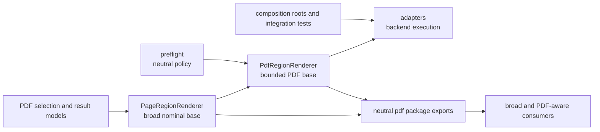

# `projectkoios.ingestion.pdf` schematic

```mermaid
flowchart LR
    Models["PDF selection and result models"]
    PageBase["PageRegionRenderer<br/>broad nominal base"]
    PdfBase["PdfRegionRenderer<br/>bounded PDF base"]
    Preflight["preflight<br/>neutral policy"]
    Adapter["adapters<br/>backend execution"]
    Exports["neutral pdf package exports"]
    Consumers["broad and PDF-aware consumers"]
    Roots["composition roots and integration tests"]

    Models --> PageBase
    PageBase --> PdfBase
    Preflight --> PdfBase
    PdfBase --> Adapter
    PageBase --> Exports
    PdfBase --> Exports
    Exports --> Consumers
    Roots --> Adapter
```

Neutral package exports stop at the nominal bases. Concrete adapter selection
belongs only to composition roots and integration tests.
