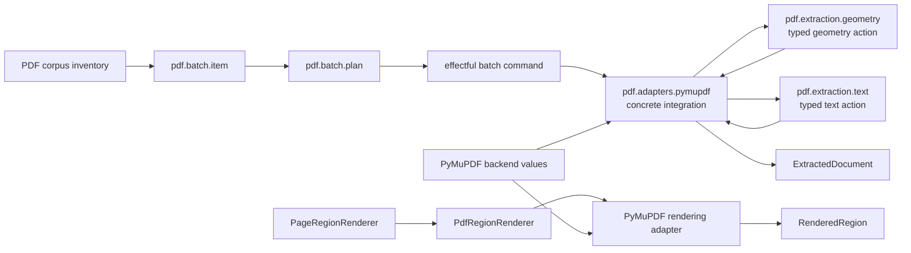

# `projectkoios.ingestion.pdf` schematic

PDF batch records declare portable checksummed inputs but perform no I/O.
Effectful commands verify those declarations and select concrete adapters.
Neutral extraction actions classify typed bounded evidence. Concrete adapters
alone translate backend objects and execute PyMuPDF operations.
