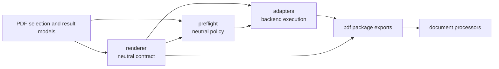

# `projectkoios.ingestion.pdf` schematic

```mermaid
flowchart LR
    Models["PDF selection and result models"]
    Renderer["renderer<br/>neutral contract"]
    Preflight["preflight<br/>neutral policy"]
    Adapter["adapters<br/>backend execution"]
    Exports["pdf package exports"]
    Consumer["document processors"]

    Models --> Renderer
    Models --> Preflight
    Renderer --> Adapter
    Renderer --> Preflight
    Preflight --> Adapter
    Adapter --> Exports
    Renderer --> Exports
    Exports --> Consumer
```

The renderer module is a contract boundary, not an intermediate execution
layer. Policy and adapter implementations remain in their owning packages.
