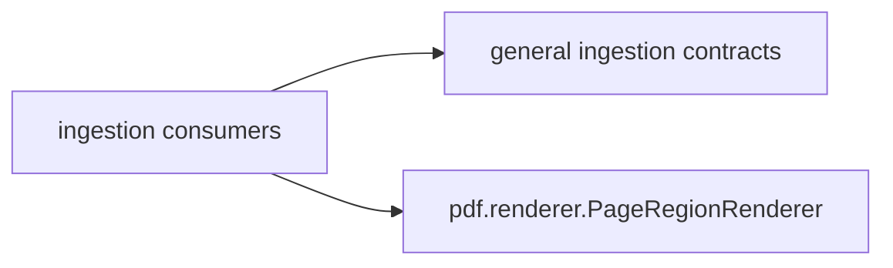

# `ingestion.protocols` schematic

```mermaid
flowchart LR
    Consumers["ingestion consumers"]
    General["general ingestion contracts"]
    PdfBase["pdf.renderer.PageRegionRenderer"]

    Consumers --> General
    Consumers --> PdfBase
```

The canonical page-renderer base is imported from its owning PDF module rather
than redefined or aliased here.
