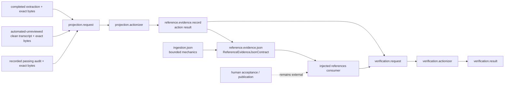

# `projectkoios.ingestion.reference.evidence` schematic

Projection is pure and binds already-produced evidence. The JSON contract is
reversible and byte-exact. Verification checks source and optional artifact
identity but does not independently establish extraction accuracy, semantic
correctness, audit validity, acceptance, or publication authority.
