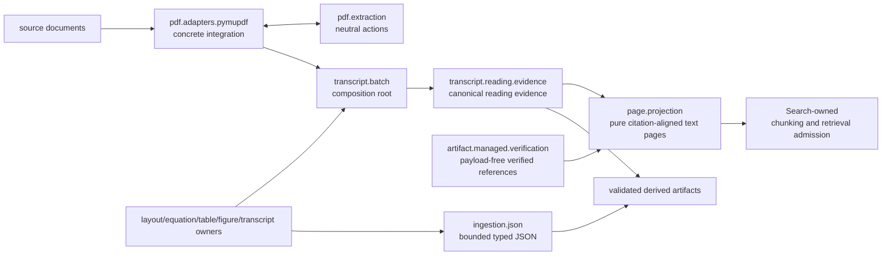

# `projectkoios.ingestion` schematic

Backend integration, neutral actions, canonical reading evidence, managed-artifact verification, pure page projection, JSON document boundaries, and Search-owned retrieval remain distinct ownership boundaries.
