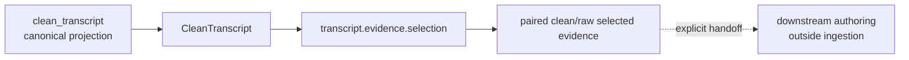

# `projectkoios.ingestion` touched-slice schematic

The selector consumes an in-memory canonical transcript. It introduces no
source-asset, reference, rights, search, generation, storage, API, or workflow
boundary.
