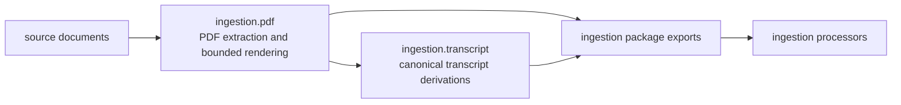

# `projectkoios.ingestion` schematic

```mermaid
flowchart LR
    Source["source documents"]
    Pdf["ingestion.pdf<br/>PDF extraction and bounded rendering"]
    Transcript["ingestion.transcript<br/>canonical transcript derivations"]
    Public["ingestion package exports"]
    Consumers["ingestion processors"]

    Source --> Pdf
    Pdf --> Transcript
    Pdf --> Public
    Transcript --> Public
    Public --> Consumers
```

The package initializer exposes owned contracts and concrete processors without
moving their implementation into the package root.
