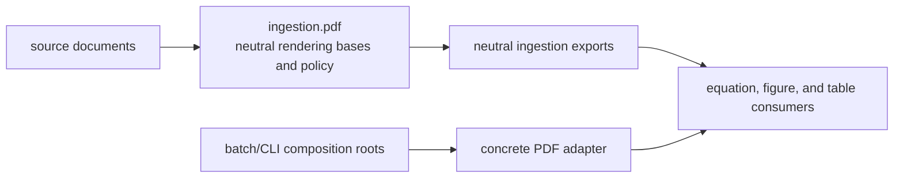

# `projectkoios.ingestion` schematic

```mermaid
flowchart LR
    Source["source documents"]
    Pdf["ingestion.pdf<br/>neutral rendering bases and policy"]
    Public["neutral ingestion exports"]
    Consumers["equation, figure, and table consumers"]
    Roots["batch/CLI composition roots"]
    Adapter["concrete PDF adapter"]

    Source --> Pdf
    Pdf --> Public
    Public --> Consumers
    Roots --> Adapter
    Adapter --> Consumers
```

Neutral exports stop at nominal bases. Concrete adapter selection occurs only
where a batch, command, or integration test composes executable processing.
