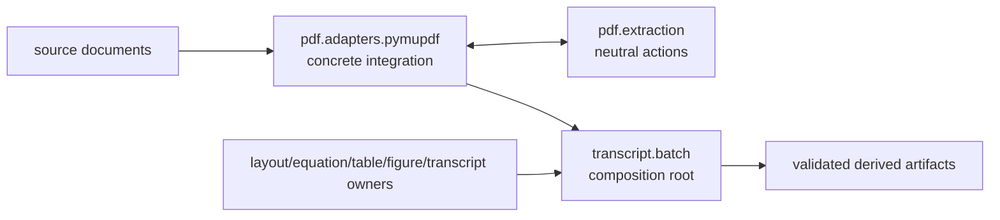

# `projectkoios.ingestion` schematic

```mermaid
flowchart LR
    Source["source documents"]
    PdfExtraction["pdf.extraction<br/>neutral actions"]
    PdfAdapter["pdf.adapters.pymupdf<br/>concrete integration"]
    TranscriptBatch["transcript.batch<br/>composition root"]
    Owners["layout/equation/table/figure/transcript owners"]
    Outputs["validated derived artifacts"]

    Source --> PdfAdapter
    PdfAdapter <--> PdfExtraction
    PdfAdapter --> TranscriptBatch
    Owners --> TranscriptBatch
    TranscriptBatch --> Outputs
```

Backend integration, neutral actions, and composition remain distinct ownership
boundaries.
