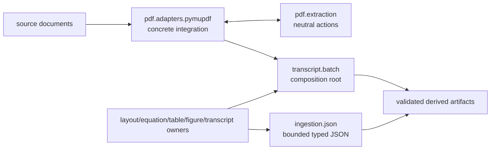

# `projectkoios.ingestion` schematic

```mermaid
flowchart LR
    Source["source documents"]
    PdfExtraction["pdf.extraction<br/>neutral actions"]
    PdfAdapter["pdf.adapters.pymupdf<br/>concrete integration"]
    TranscriptBatch["transcript.batch<br/>composition root"]
    Json["ingestion.json<br/>bounded typed JSON"]
    Owners["layout/equation/table/figure/transcript owners"]
    Outputs["validated derived artifacts"]

    Source --> PdfAdapter
    PdfAdapter <--> PdfExtraction
    PdfAdapter --> TranscriptBatch
    Owners --> TranscriptBatch
    Owners --> Json
    Json --> Outputs
    TranscriptBatch --> Outputs
```

Backend integration, neutral actions, JSON document boundaries, and composition
remain distinct ownership boundaries.
