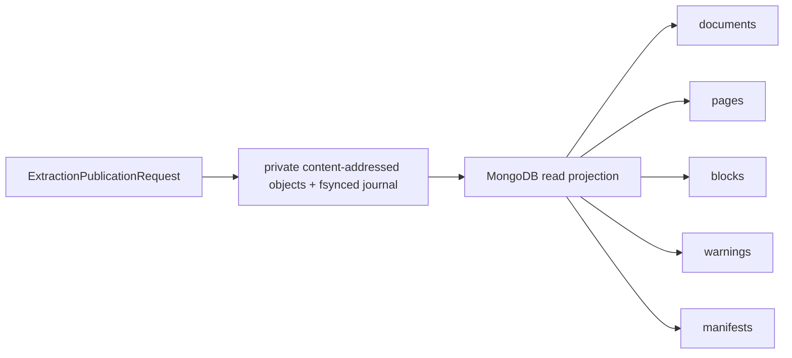

# Extraction storage schematic

```mermaid
flowchart LR
    Request["ExtractionPublicationRequest"]
    Disk["private content-addressed objects + fsynced journal"]
    Mongo["MongoDB read projection"]
    Documents["documents"]
    Pages["pages"]
    Blocks["blocks"]
    Warnings["warnings"]
    Manifests["manifests"]

    Request --> Disk
    Disk --> Mongo
    Mongo --> Documents
    Mongo --> Pages
    Mongo --> Blocks
    Mongo --> Warnings
    Mongo --> Manifests
```

Disk commit precedes projection. A lost or empty MongoDB database can be rebuilt
by replaying the bounded journal through an
`ExtractionProjectionRecoveryRequest`.
