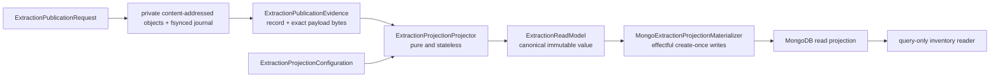

# Extraction storage schematic

Disk commit precedes projection and remains authoritative. A lost or empty
MongoDB target can be rebuilt by reading bounded exact journal evidence,
projecting it without I/O, and materializing the resulting read models.

The arrows have strict names: reading obtains **source evidence**, projection is
a pure evidence-to-value transformation, materialization writes that value, and
inventory observes the resulting target. Record selection, authority, retries,
index readiness, target identity, and equivalence verification are outside the
projector.
