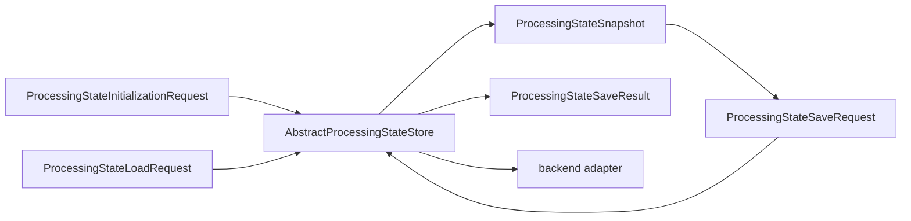

# Processing-state storage schematic

Only the backend adapter owns persistence-specific commands and transaction
objects. A workflow derives a complete next snapshot and submits it with the
exact snapshot identity it observed.
