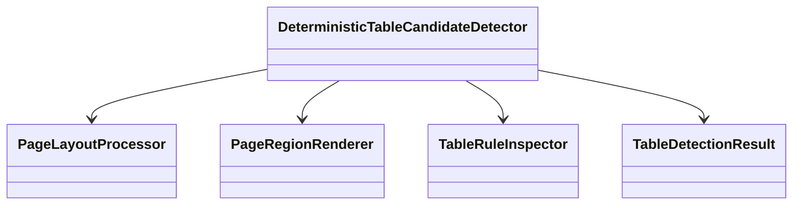

# `DeterministicTableCandidateDetector` schematic

```mermaid
classDiagram
    class DeterministicTableCandidateDetector
    class PageLayoutProcessor
    class PageRegionRenderer
    class TableRuleInspector
    class TableDetectionResult

    DeterministicTableCandidateDetector --> PageLayoutProcessor
    DeterministicTableCandidateDetector --> PageRegionRenderer
    DeterministicTableCandidateDetector --> TableRuleInspector
    DeterministicTableCandidateDetector --> TableDetectionResult
```

The detector owns table policy but not concrete renderer selection.
