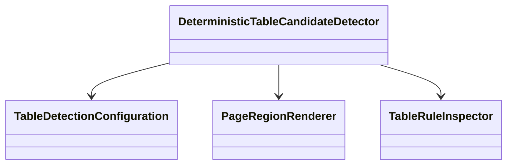

# `tables.contracts` schematic

```mermaid
classDiagram
    class TableDetectionConfiguration
    class PageRegionRenderer
    class TableRuleInspector
    class DeterministicTableCandidateDetector

    DeterministicTableCandidateDetector --> TableDetectionConfiguration
    DeterministicTableCandidateDetector --> PageRegionRenderer
    DeterministicTableCandidateDetector --> TableRuleInspector
```

The facade receives capabilities; it does not compose concrete implementations.
