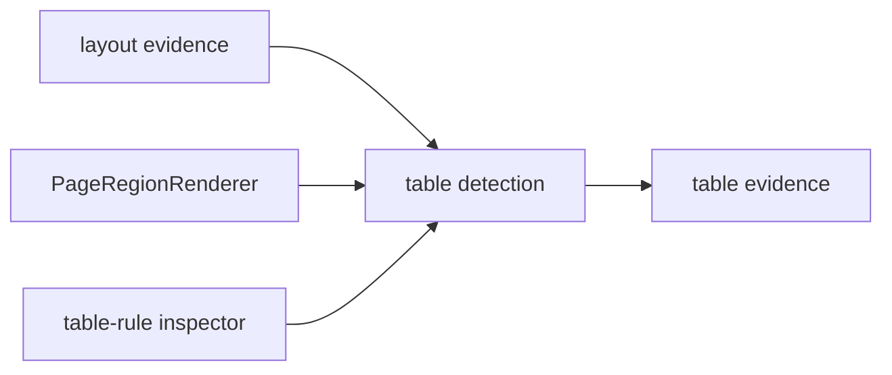

# `ingestion.tables` schematic

```mermaid
flowchart LR
    Layout["layout evidence"]
    Renderer["PageRegionRenderer"]
    Inspector["table-rule inspector"]
    Detection["table detection"]
    Result["table evidence"]

    Layout --> Detection
    Renderer --> Detection
    Inspector --> Detection
    Detection --> Result
```

Concrete renderer composition stays outside the package's neutral detection
boundary.
