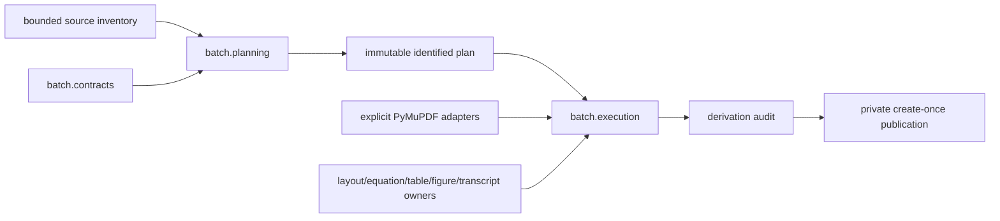

# `ingestion.transcript.batch` schematic

```mermaid
flowchart LR
    Inventory["bounded source inventory"]
    Contracts["batch.contracts"]
    Planning["batch.planning"]
    Plan["immutable identified plan"]
    Execution["batch.execution"]
    Adapter["explicit PyMuPDF adapters"]
    Owners["layout/equation/table/figure/transcript owners"]
    Audit["derivation audit"]
    Publish["private create-once publication"]

    Inventory --> Planning
    Contracts --> Planning
    Planning --> Plan
    Plan --> Execution
    Adapter --> Execution
    Owners --> Execution
    Execution --> Audit --> Publish
```

The batch package composes owners; it does not absorb their contracts or backend
implementations.
