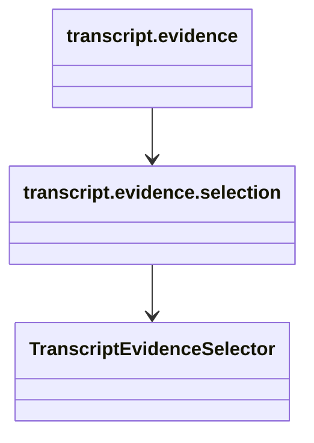

# `projectkoios.ingestion.transcript.evidence` implementation

The package initializer establishes ownership without duplicating child-class
exports. The `selection` child owns the only implemented evidence operation.

The hierarchy adds no source-asset or bibliographic-reference linkage.
