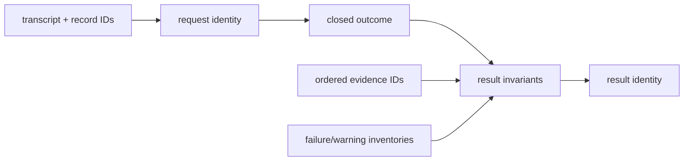

# `selection.contracts` implementation

The request canonicalizes the bounded input-ID tuple and derives its identity
from that tuple and the exact transcript result. The result enforces the closed
outcome/evidence partition and derives its identity from request, producer,
outcome, ordered evidence, warning, and failure inventories.

Failed outcomes expose no page or block evidence. Only `EVIDENCE_AVAILABLE`
requires a complete canonical evidence inventory.
