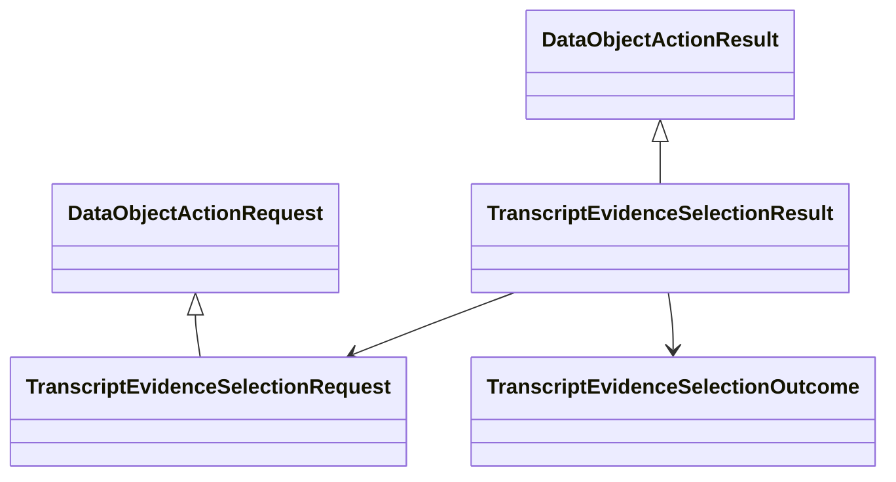

# `selection.contracts` schematic

```mermaid
classDiagram
    class DataObjectActionRequest
    class DataObjectActionResult
    class TranscriptEvidenceSelectionRequest
    class TranscriptEvidenceSelectionResult
    class TranscriptEvidenceSelectionOutcome

    DataObjectActionRequest <|-- TranscriptEvidenceSelectionRequest
    DataObjectActionResult <|-- TranscriptEvidenceSelectionResult
    TranscriptEvidenceSelectionResult --> TranscriptEvidenceSelectionRequest
    TranscriptEvidenceSelectionResult --> TranscriptEvidenceSelectionOutcome
```
