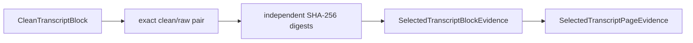

# `selection.evidence` implementation

Block evidence retains transcript/page/root-block/record identities, canonical
order, clean indexed text and digest, exact raw text and digest, transformation
evidence, dehyphenation links, and the exact-pair mapping basis. Page evidence
retains aligned ordered evidence, root-block, and record-ID tuples.

Both evidence identities bind all retained fields relevant to their handoff.
