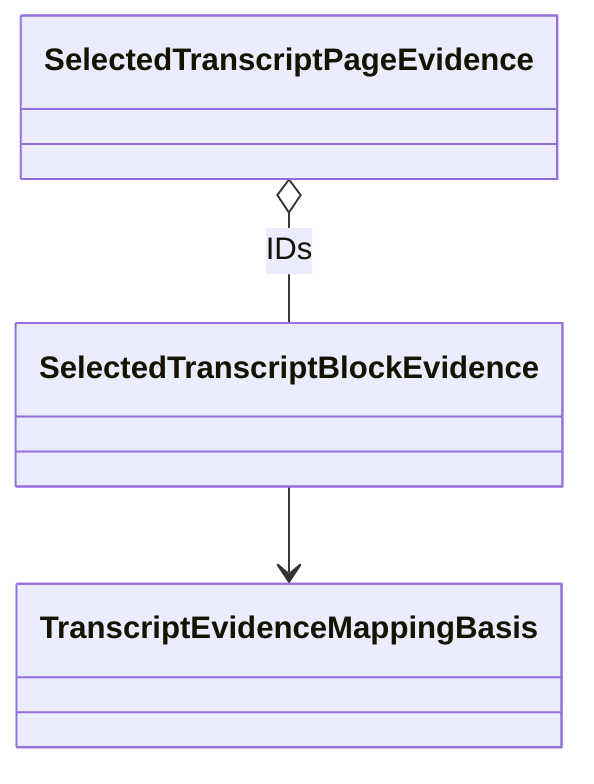

# `selection.evidence` schematic

```mermaid
classDiagram
    class SelectedTranscriptBlockEvidence
    class SelectedTranscriptPageEvidence
    class TranscriptEvidenceMappingBasis

    SelectedTranscriptBlockEvidence --> TranscriptEvidenceMappingBasis
    SelectedTranscriptPageEvidence o-- SelectedTranscriptBlockEvidence : IDs
```

Page evidence groups selected block identities without duplicating their text.
