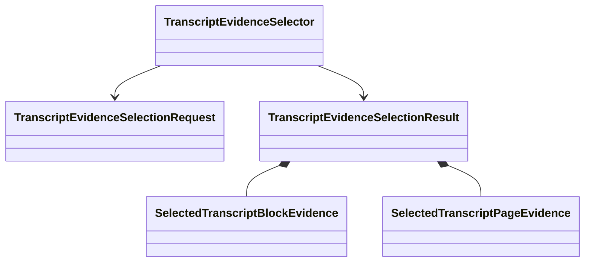

# `transcript.evidence.selection` implementation

The local `__init__.py` facade exports the exact classes defined by the three
owned modules. `contracts.py` owns action intent and outcome invariants,
`evidence.py` owns clean/raw handoff records, and `selector.py` owns selection
policy and all of its helper methods.

The package preserves the identities, closed outcomes, canonical ordering,
warning fail-closed behavior, and single `action` to `select` path established
by the original prototype. The root `projectkoios.ingestion` initializer
intentionally re-exports the same class objects; no other path does.
