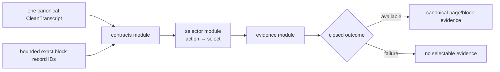

# `transcript.evidence.selection` schematic

```mermaid
flowchart LR
    Transcript["one canonical CleanTranscript"]
    IDs["bounded exact block record IDs"]
    Contracts["contracts module"]
    Evidence["evidence module"]
    Selector["selector module<br/>action → select"]
    Result{"closed outcome"}

    Transcript --> Contracts
    IDs --> Contracts
    Contracts --> Selector
    Selector --> Evidence
    Evidence --> Result
    Result -->|available| Selected["canonical page/block evidence"]
    Result -->|failure| Empty["no selectable evidence"]
```

The local package initializer is the canonical public facade. The removed
`projectkoios.ingestion.transcript_evidence_selection` module has no alias.
