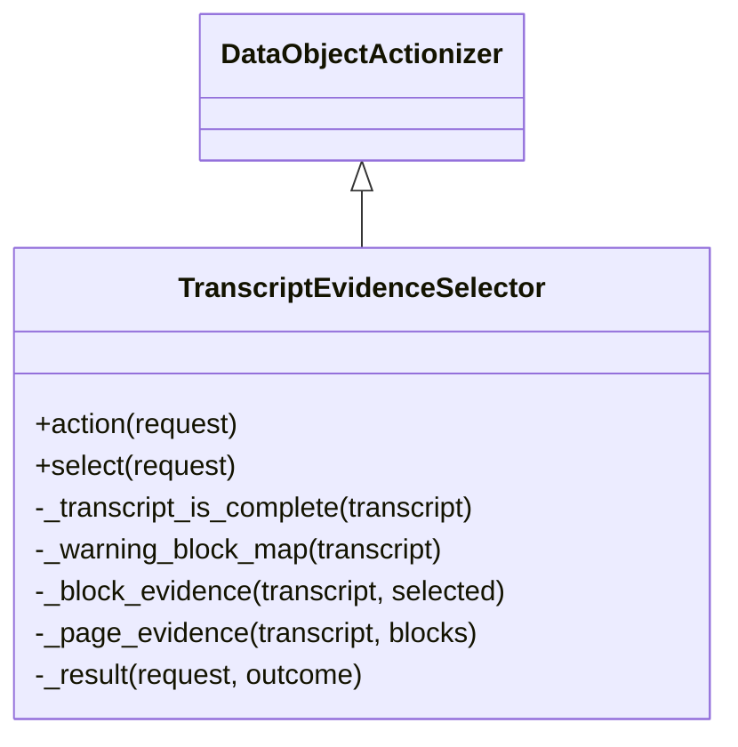

# `selection.selector` implementation

`TranscriptEvidenceSelector.action(*, request)` delegates directly to
`select(*, request)`. Class-owned helpers validate ID grammar and duplicates,
verify intrinsic transcript completeness, map supported warnings to exact root
blocks, construct canonical block/page evidence, and construct every result.

Globally scoped or selected-block warnings return
`WARNING_INSPECTION_REQUIRED` with no selectable evidence. Exact existing
records may establish that selected blocks are unaffected only when every
warning can be resolved to block IDs.
