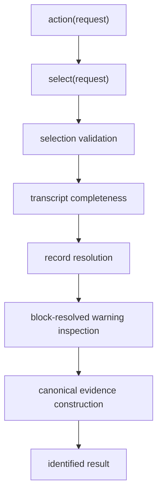

# `selection.selector` schematic

```mermaid
flowchart TD
    Action["action(request)"] --> Select["select(request)"]
    Select --> Validate["selection validation"]
    Validate --> Complete["transcript completeness"]
    Complete --> Resolve["record resolution"]
    Resolve --> Warnings["block-resolved warning inspection"]
    Warnings --> Build["canonical evidence construction"]
    Build --> Result["identified result"]
```

Every fail-closed branch returns through the same result constructor helper.
