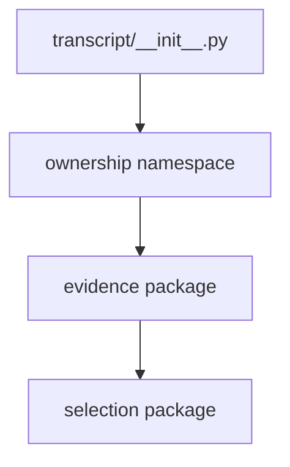

# `projectkoios.ingestion.transcript` implementation

The package initializer defines the transcript-derived namespace without
re-exporting child classes. Canonical selection classes are owned lower in the
source hierarchy and intentionally surfaced only by their local facade and the
root `projectkoios.ingestion` facade.

No compatibility alias for `transcript_evidence_selection` is retained.
