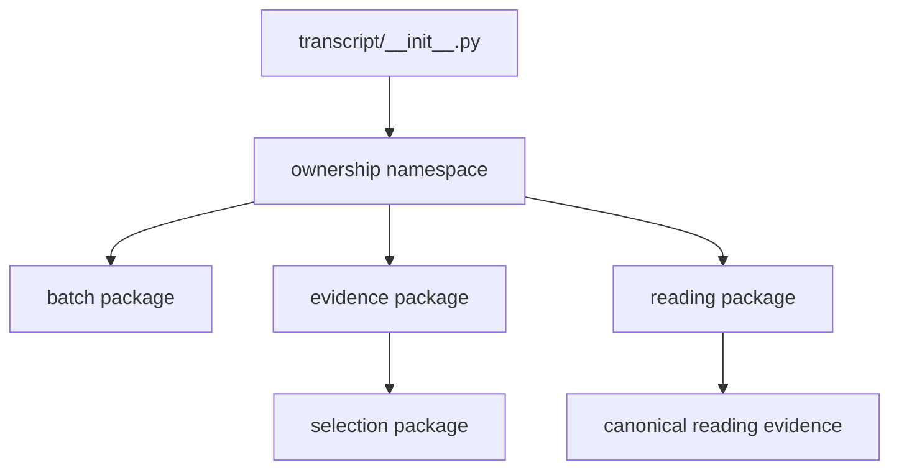

# `projectkoios.ingestion.transcript` implementation

The package initializer is a docstring-only transcript ownership marker. Canonical implementations are imported directly from defining leaves; no root façade or compatibility alias is planned for the rewrite.

`transcript.batch` owns transcript-run planning/execution/publication. `transcript.evidence` owns bounded transcript-derived selection. `transcript.reading.evidence` owns the clean canonical projection consumed by page projection. MongoDB integration owns current-schema storage and migration. None owns PDF backend implementation, source routing, rights policy, Search, ranking, or indexing.
