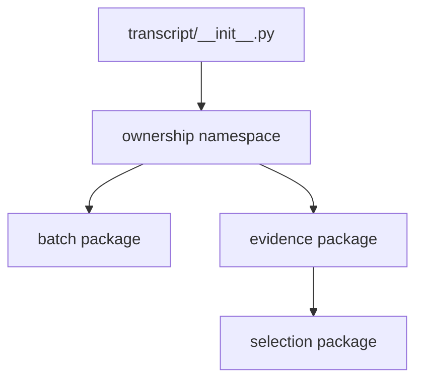

# `projectkoios.ingestion.transcript` implementation

The package initializer defines the transcript-owned namespace without
re-exporting child classes. Canonical implementations are imported from their
defining child modules and surfaced through an established root facade only
when that public API is separately intentional.

`transcript.batch` owns composition, planning, and publication for transcript
runs. `transcript.evidence` owns transcript-derived evidence operations. Neither
package owns PDF backend implementation, source routing, rights policy, Search,
or indexing.

No compatibility alias is added inside namespace-only package initializers.
Any established root API retained during a source move remains explicit and is
reviewed separately from internal ownership.
