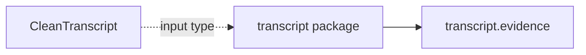

# `projectkoios.ingestion.transcript` schematic

```mermaid
flowchart LR
    Transcript["CleanTranscript"]
    Package["transcript package"]
    Evidence["transcript.evidence"]

    Transcript -. "input type" .-> Package
    Package --> Evidence
```

The package is an ownership boundary, not a second transcript representation.
