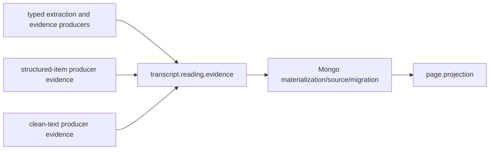

# `projectkoios.ingestion.transcript` schematic

```mermaid
flowchart LR
    Producers["typed extraction and evidence producers"]
    Structured["structured-item producer evidence"]
    Clean["clean-text producer evidence"]
    Reading["transcript.reading.evidence"]
    Mongo["Mongo materialization/source/migration"]
    Page["page.projection"]

    Producers --> Reading
    Structured --> Reading
    Clean --> Reading
    Reading --> Mongo
    Mongo --> Page
```

The package is an ownership boundary, not a compatibility representation for prototype transcript files or Python values.
