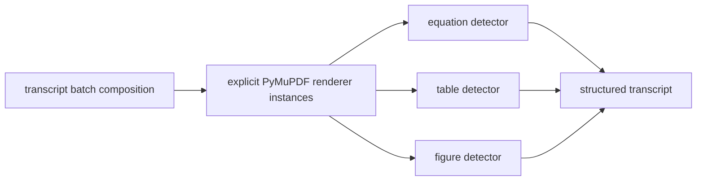

# `ingestion.transcript_batch` schematic

```mermaid
flowchart LR
    Batch["transcript batch composition"]
    Adapter["explicit PyMuPDF renderer instances"]
    Equations["equation detector"]
    Tables["table detector"]
    Figures["figure detector"]
    Transcript["structured transcript"]

    Batch --> Adapter
    Adapter --> Equations
    Adapter --> Tables
    Adapter --> Figures
    Equations --> Transcript
    Tables --> Transcript
    Figures --> Transcript
```

Each neutral consumer receives a renderer configured for its existing aggregate
bounds.
