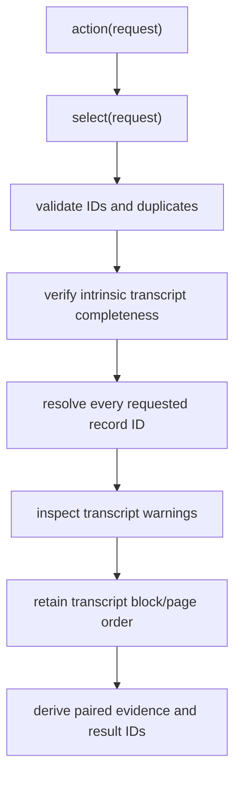

# `transcript_evidence_selection` implementation

## Single semantic path

`TranscriptEvidenceSelector.action(*, request)` delegates directly to
`select(*, request)`. The request embeds one exact `CleanTranscript`,
canonicalizes the bounded record-ID tuple for order-independent intent, and
derives `request_id` from the transcript result ID and exact tuple.

## Fail-closed outcomes

The closed outcome set distinguishes `INVALID_SELECTION`, `MISSING_BLOCK`,
`TRANSCRIPT_NOT_COMPLETE`, `WARNING_INSPECTION_REQUIRED`, and
`EVIDENCE_AVAILABLE`. Empty, malformed, or duplicate selections are invalid;
a well-formed absent record ID is missing. Intrinsic completeness requires
contiguous page and block order, exact page membership, consistent page
metadata, and reconstructed page text.

Transcript warnings are always copied to the result. Globally scoped warnings
cannot be silently admitted. The selector can resolve only warning kinds whose
existing transcript records identify affected root block IDs. Evidence is
available under a nonempty warning set only when every warning is block-resolved
and the exact selected blocks are disjoint from all affected blocks. Otherwise
the result is inspection-required and contains no selectable evidence.

## Evidence and identity

`SelectedTranscriptBlockEvidence` retains transcript, page, root block, and
clean-block record IDs; canonical order; clean indexed text and SHA-256; exact
raw text and SHA-256; transformation evidence; dehyphenation decision IDs; and
the explicit `CLEAN_TRANSCRIPT_BLOCK_EXACT_PAIR` mapping basis.
`SelectedTranscriptPageEvidence` groups selected block and record IDs under the
canonical transcript page ID, physical index, and printed label.

Every request, block evidence record, page evidence record, and result receives
a deterministic content-derived ID. The result identity binds request and
transcript IDs, selector identity, outcome, ordered evidence IDs, failure
inventories, exact transcript warnings, inspection warnings, and the
block-resolution capability flag.

## Boundaries

The selection limit is 256 block record IDs. The module performs no retrieval,
ranking, source/reference association, rights decision, citation, generation,
persistence, serialization-version negotiation, API handling, workflow, or
private-data operation. The upstream clean-transcript evidence model is
specified by the existing
[clean-transcript contract](../../../../contracts/clean-transcript.md).
