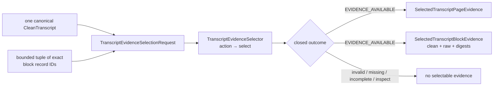

# `transcript_evidence_selection` schematic

All non-available outcomes expose empty page and block tuples. Page and block
evidence retain only transcript-local handoff identities and text evidence.
