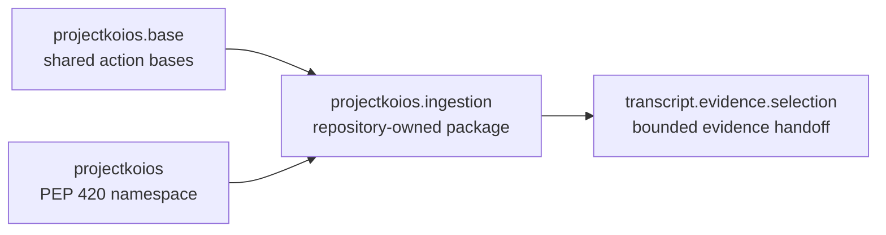

# `projectkoios` namespace schematic

```mermaid
flowchart LR
    Base["projectkoios.base<br/>shared action bases"]
    Namespace["projectkoios<br/>PEP 420 namespace"]
    Ingestion["projectkoios.ingestion<br/>repository-owned package"]
    Selection["transcript.evidence.selection<br/>bounded evidence handoff"]

    Base --> Ingestion
    Namespace --> Ingestion
    Ingestion --> Selection
```

Only the ingestion package and its children are implemented here. The namespace
root has no local initializer.
